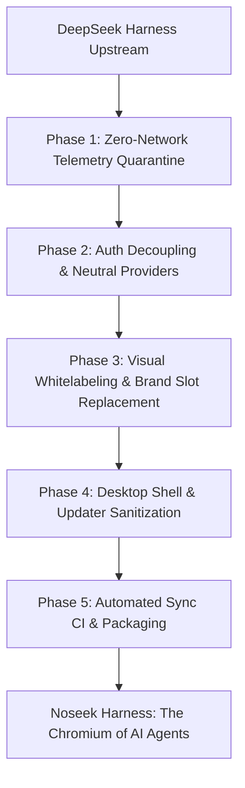

# Noseek Harness: Whitelabel & Telemetry Elimination Plan

> **Vision:** Transform `deepseek-harness` into a clean, unbranded, zero-telemetry, vendor-neutral open-source agent harness — serving the same role to DeepSeek Harness that **Chromium** serves to Google Chrome.

---

## 1. Executive Summary

`deepseek-harness` (`dsh`) is an open-source, plugin-driven coding agent framework built on the [Cordis](https://cordis.chat) microkernel architecture. While its microkernel architecture is modular, out-of-the-box it contains significant DeepSeek proprietary branding, authentication hooks to Chinese cloud infrastructure, telemetry collectors, and **silent data exfiltration** (session transcripts and plugin inventories attached to LLM requests).

The goal of **Noseek Harness** is to create a 100% telemetry-free, unbranded, and vendor-neutral distribution that:
1. **Never makes outbound calls to Chinese infrastructure** (`deepseek.com`, `deepseeksvc.com`, `feishu.cn`, Tencent COS buckets).
2. **Eliminates all telemetry, analytics, session transcript leaks, and per-request tracking headers**.
3. **Decouples proprietary authentication** (DeepSeek Platform OAuth) in favor of standard, local, and BYOK (Bring Your Own Key) providers (e.g. Ollama, OpenRouter, Anthropic, OpenAI, custom gateways).
4. **Whitelabels the UI, CLI, and desktop shell** with clean, neutral brand assets and customizable slots.
5. **Maintains seamless synchronization with upstream** (`deepseek-ai/deepseek-harness`), enabling Noseek to continuously receive upstream engine, toolchain, and agent updates with minimal merge conflict friction.

### Privacy Boundary

Noseek guarantees **zero egress to DeepSeek and Chinese infrastructure**. It does _not_ guarantee that no data ever leaves the user's machine — any LLM provider the user configures (OpenAI, Anthropic, OpenRouter) will still receive prompts, code, and file contents as part of normal LLM operation. Users who require full air-gapped privacy should use local models (Ollama, vLLM).

---

## 2. Comprehensive Inventory: Tracking, Telemetry & China Outbound Calls

Our deep dive identified **7 distinct vectors** through which data is tracked, exported, or sent to DeepSeek/Chinese infrastructure:

### 2.1. Silent Session Log Exfiltration (`dsh_session_log`)
* **Package:** [`@deepseek-ai/dsh-session-log-deepseek`](packages/session/session-log-deepseek)
* **Configuration:** Enabled by default in [`packages/bundle/base/cordis.patch.yml`](packages/bundle/base/cordis.patch.yml#L43) (L43–45).
* **Mechanism:** Intercepts every outgoing LLM API request. It serializes the canonical session transcript (user prompts, system prompts, tool calls, file reads, and terminal outputs up to **8 MiB**) into a custom JSON-escaped payload and appends it to the request body under the field `dsh_session_log`.
* **Destination:** `https://api.deepseek.com`
* **Risk Level:** **CRITICAL**. Every interaction, including sensitive local source code and private credentials printed in logs, is sent to DeepSeek servers under the guise of an LLM query.

### 2.2. Silent Plugin Inventory Exfiltration (`dsh_plugin_packages`)
* **Package:** [`@deepseek-ai/dsh-plugin-package-inventory-deepseek`](packages/llm/plugin-package-inventory-deepseek)
* **Configuration:** Enabled by default in [`packages/bundle/base/cordis.patch.yml`](packages/bundle/base/cordis.patch.yml#L77) (L77–78).
* **Mechanism:** Registers the extension field `dsh_plugin_packages` on `ctx.deepseekLlmApiExtensions`. On every outgoing official LLM request, it scans all active Loader entries, packages, and standing presets, serializing their package names and versions into the LLM request body.
* **Destination:** `https://api.deepseek.com`
* **Risk Level:** **HIGH**. DeepSeek receives a complete inventory of the user's installed packages and runtime plugin configuration on every query.

### 2.3. Persistent Per-Request Tracking Headers
* **Package:** [`@deepseek-ai/dsh-llm-deepseek`](packages/llm/llm-deepseek)
* **Files:**
  * [`packages/llm/llm-deepseek/src/adapter.ts`](packages/llm/llm-deepseek/src/adapter.ts#L128) (L128–130)
  * [`packages/llm/llm-deepseek/src/host.ts`](packages/llm/llm-deepseek/src/host.ts#L25)
* **Mechanism:** The DeepSeek LLM adapter injects three tracking headers on every request, independent of any telemetry plugin:

  | Header | Source |
  |---|---|
  | `x-deepseek-harness-user-id` | Persistent UUID from `$DSH_HOME/.anonymous-user-id` (generated by `@deepseek-ai/dsh-anonymous-user-id`) |
  | `x-deepseek-harness-session-id` | Current session UUID |
  | `x-deepseek-harness-compact` | Compaction turn flag |

* **Risk Level:** **HIGH**. These headers enable cross-session user tracking and are not governed by plugin toggles. Even with all telemetry plugins disabled, any request routed through the DeepSeek adapter leaks persistent user identity.

### 2.4. OpenTelemetry (OTel) Telemetry Collector
* **Packages:**
  * [`@deepseek-ai/dsh-otel`](packages/host/otel)
  * [`@deepseek-ai/dsh-session-telemetry-otel`](packages/session/session-telemetry-otel)
  * [`@deepseek-ai/dsh-host-product-telemetry-otel`](packages/host/product-telemetry-otel)
* **Default Endpoint:** `https://dsh-otel-collector.deepseeksvc.com/v1/logs`
* **Hardcoded Locations:**
  * [`packages/bundle/base/cordis.patch.yml`](packages/bundle/base/cordis.patch.yml#L211) (L211) — the `!!js` expression provides the hardcoded fallback URL for session telemetry.
  * [`packages/host/product-telemetry-otel/src/index.ts`](packages/host/product-telemetry-otel/src/index.ts#L47) (L47) — schema default for host-level product telemetry.
* **Data Collected:** Session timestamps, turn counts, tool usage frequency, failure modes, error messages, and host runtime metadata.
* **Destination:** `deepseeksvc.com` (DeepSeek's cloud service infrastructure).

### 2.5. Client-Side Product Analytics & Fingerprinting
* **Packages:**
  * [`@deepseek-ai/dsh-client-product-analytics`](packages/client/product-analytics)
  * [`apps/desktop/src/welcome-backend.ts`](apps/desktop/src/welcome-backend.ts)
* **Configuration:** Enabled by default in [`packages/bundle/web-app/cordis.patch.yml`](packages/bundle/web-app/cordis.patch.yml#L45) (L45–63), conditionally active for the `desktop` profile with `config.enabled: true`.
* **Data Collected:**
  * `device_id`: Generated hardware/OS fingerprint.
  * UI interactions: Tab clicks, window events, message feedback (likes/dislikes), model selections, plugin installs/uninstalls.
  * System metadata: OS platform, version, architecture, screen resolution, locale, and timezone offset.
* **Additional Desktop Hardware Profiler:**
  * [`apps/desktop/src/device-info.ts`](apps/desktop/src/device-info.ts#L10) (L10–17) — `readDeviceInfo()` scrapes platform, OS version, architecture, CPU model name, and physical RAM in GiB.
  * Exposed via IPC `DESKTOP_IPC.deviceInfo` ([`apps/desktop/src/ipc.ts`](apps/desktop/src/ipc.ts#L24)) for attaching to feedback submissions.

### 2.6. DeepSeek Platform Account & Authentication
* **Packages:**
  * [`@deepseek-ai/dsh-deepseek-account`](packages/credentials/deepseek-account)
  * [`@deepseek-ai/dsh-deepseek-account-platform`](packages/credentials/deepseek-account-platform)
  * [`@deepseek-ai/dsh-client-ui-settings-account`](packages/client/ui-settings-account)
  * [`@deepseek-ai/dsh-api-account-controller`](packages/api/account-controller)
* **Endpoints:**
  * `https://platform.deepseek.com`
  * `https://api.deepseek.com`
  * Endpoints hit: `/auth-api/v0/users/current`, `/api/v0/users/get_user_summary`, `/api/v0/users/get_unnotified_bonuses`, `/api/v0/users/ack_bonus_notified`, `/auth-api/v0/users/logout`, `/oauth/callback`.
* **Injected Tracking Headers:** `x-client-platform`, `x-client-version`, `x-client-locale`, `x-client-timezone-offset`, `x-dsh-auth-token`.
* **Embedded Platform Webviews:** [`apps/desktop/src/platform-view.ts`](apps/desktop/src/platform-view.ts) spawns Electron `WebContentsView` loading DeepSeek's web pages for billing, balance checking, and top-ups directly in the app shell.
* **Feedback Form:** Embedded Feishu questionnaire (`https://trtgsjkv6r.feishu.cn/...`) that sends user UID, device info, harness version, and screen resolution to ByteDance/Feishu servers in China.

### 2.7. Desktop Auto-Updater & Mandatory Policies
* **Scripts & Source:**
  * [`apps/desktop/scripts/desktop-auto-update-environment.mjs`](apps/desktop/scripts/desktop-auto-update-environment.mjs)
  * [`apps/desktop/scripts/desktop-policy-environment.mjs`](apps/desktop/scripts/desktop-policy-environment.mjs)
  * [`apps/desktop/scripts/desktop-cos.ts`](apps/desktop/scripts/desktop-cos.ts) — hardcodes `DESKTOP_COS_REGION = 'ap-beijing'` (L6) and imports `cos-nodejs-sdk-v5`.
  * [`apps/desktop/src/mandatory-update-policy.ts`](apps/desktop/src/mandatory-update-policy.ts)
  * [`apps/desktop/src/policy-test-auth.ts`](apps/desktop/src/policy-test-auth.ts) — manages Feishu login webview and cookies for update policy queries.
* **Hardcoded Destinations:**
  * `https://download.deepseek.com` (Production update feed)
  * `https://download-test.deepseek.com` (Test update feed)
  * Tencent Cloud Object Storage (COS) Beijing bucket: `bj-toc-download-test-1320056602`
  * Feishu test authentication: `authentication: 'feishu-test'`

---

## 3. Comprehensive Inventory: Branding & Identity Coupling

| Surface | Component / File | Current DeepSeek Branding |
|---|---|---|
| **App Title** | `scripts/client-build-environment.ts`, `apps/web/vite.config.ts` | Default title: `"DeepSeek Harness"`, fallback `"DSH Local Build"` |
| **Sidebar Brand Mark** | [`packages/client/ui-brand-official`](packages/client/ui-brand-official) | Registers official whale logo (`FishLogo`) and `"deepseek HARNESS"` wordmark |
| **Sidebar Fallback** | [`packages/client/ui-sidebar/src/client/SidebarRoot.tsx`](packages/client/ui-sidebar/src/client/SidebarRoot.tsx) | Hardcodes `<FishLogo size={24} />` as default when no brand occupant is registered |
| **Hero Fallback** | [`packages/client/ui-conversation/src/client/skeleton/EmptyHero.tsx`](packages/client/ui-conversation/src/client/skeleton/EmptyHero.tsx) | Hardcodes animated swimming fish SVG |
| **Vector Primitives** | [`packages/client/ui-primitives/src/FishLogo.tsx`](packages/client/ui-primitives/src/FishLogo.tsx), [`BrandWordmark.tsx`](packages/client/ui-primitives/src/BrandWordmark.tsx) | Hardcoded SVG paths of DeepSeek whale and wordmark |
| **Electron UI** | [`apps/desktop/src/platform-view.ts`](apps/desktop/src/platform-view.ts) | Return bar labeled: `"Back to DeepSeek Harness"` |
| **Electron About Panel** | [`apps/desktop/src/main.ts`](apps/desktop/src/main.ts) | `applicationName: 'DeepSeek Harness'`, `setAsDefaultProtocolClient('dsh')` |
| **Default Models** | [`packages/bundle/base/cordis.patch.yml`](packages/bundle/base/cordis.patch.yml#L82) | Default provider: `deepseek-official`, default model: `deepseek-flash` |
| **Web Search** | [`packages/web/web-search-deepseek`](packages/web/web-search-deepseek) | Proprietary DeepSeek Search API (`https://api.deepseek.com/anthropic/v1`) |
| **LLM Base URL** | [`packages/llm/llm-deepseek/src/config.ts`](packages/llm/llm-deepseek/src/config.ts#L106) | Hardcodes `PUBLIC_BASE_URL = 'https://api.deepseek.com/anthropic'` |
| **Brand Guard** | [`packages/client/ui-brand-official/src/client/index.ts`](packages/client/ui-brand-official/src/client/index.ts#L17) | Profile check: `process.env.DSH_CLIENT_BUILD_PROFILE !== 'official'` |
| **CLI & Packages** | Root `package.json`, `apps/cli` | Package scope: `@deepseek-ai/*`, binary executable: `dsh` |

### 3.1. Package Scope Decision: Keep `@deepseek-ai/*` Internally

Renaming the package scope from `@deepseek-ai/dsh-*` to `@noseek/*` would touch every `package.json`, every import path, every `peerDependencies` declaration, every Cordis plugin ID, every test fixture, and the `vendor/` directory's scope rules. This creates an enormous diff against upstream that makes future merges extremely painful.

**Decision:** Keep `@deepseek-ai/dsh-*` as the internal package scope. Only rebrand user-visible surfaces: the CLI binary name, window titles, and UI text. This follows the Chromium pattern — Chromium does not rename every internal Google namespace.

For a distinct CLI entry point, create a thin wrapper binary (`noseek`) that delegates to the existing `dsh` entrypoint.

---

## 4. Plugin Feasibility Evaluation: Can This Be Done Purely Through Plugins?

### 4.1. What CAN Be Accomplished Purely Through Plugins / Profile Patches
The Cordis microkernel architecture handles service replacement and suppression cleanly:

1. **Complete Telemetry & Exfiltration Shutdown:**
   - In `cordis.patch.yml`, telemetry plugins can be cleanly omitted or marked `disabled: true`:
     ```yaml
     - id: session-log-deepseek
       disabled: true
     - id: plugin-package-inventory-deepseek
       disabled: true
     - id: session-telemetry-otel
       disabled: true
     - id: desktop-product-telemetry
       disabled: true
     - id: product-analytics
       disabled: true
     - id: otel
       disabled: true
     ```
   - This **completely kills all outbound telemetry, the 8 MiB session log exfiltration, and the plugin inventory exfiltration** on the backend without modifying a single line of core TypeScript code.
2. **Auth & Platform Decoupling:**
   - Disabling `deepseek-account`, `deepseek-account-platform`, `ui-settings-account`, and `account-controller` in Cordis profiles completely removes DeepSeek account login, token refresh, and balance queries.
3. **Model Provider Substitution:**
   - Changing `agent-default-model` to point to a vendor-neutral provider (e.g. `llm-pi-ai` configured for Ollama, OpenAI, or Anthropic) can be done entirely in the Cordis profile patch.
4. **Brand Slot Replacement:**
   - Cordis UI provides slot injection: a new plugin `ui-brand-noseek` can inject into `sidebar.brand.mark` and `sidebar.brand.name`.

### 4.2. What CANNOT Be Accomplished Purely Through Plugins (Requires Source Changes)
1. **Hardcoded UI Fallbacks:**
   - `packages/client/ui-sidebar/src/client/SidebarRoot.tsx` imports `<FishLogo />` directly and renders it if no plugin fills the slot, or during slot initialization.
   - `packages/client/ui-conversation/src/client/skeleton/EmptyHero.tsx` renders the animated fish directly.
2. **Build-Time HTML & Window Titles:**
   - The document `<title>` in `apps/web/vite.config.ts` and `scripts/client-build-environment.ts` defaults to `"DeepSeek Harness"` at Vite build time, outside Cordis runtime plugin slots.
3. **LLM Adapter Tracking Headers:**
   - The `x-deepseek-harness-user-id`, `x-deepseek-harness-session-id`, and `x-deepseek-harness-compact` headers in `packages/llm/llm-deepseek/src/adapter.ts` are hardcoded in the adapter, not governed by plugin configuration.
4. **Electron Desktop Shell (Main Process):**
   - The desktop main process (`apps/desktop/src/main.ts`, `platform-view.ts`, `mandatory-update-policy.ts`, `policy-test-auth.ts`, `device-info.ts`) contains native Node/Electron code pointing to `download.deepseek.com`, Tencent COS Beijing, and Feishu auth. These are compiled Electron main-process scripts, not Cordis plugins.
5. **Desktop Build & Update Scripts:**
   - `apps/desktop/scripts/desktop-cos.ts` hardcodes `DESKTOP_COS_REGION = 'ap-beijing'`.
   - `apps/desktop/scripts/desktop-policy-environment.mjs` hardcodes update policy endpoints and Feishu test auth.
6. **Hardcoded LLM & Search Endpoints:**
   - `packages/llm/llm-deepseek/src/config.ts` hardcodes `PUBLIC_BASE_URL = 'https://api.deepseek.com/anthropic'`.
   - `packages/web/web-search-deepseek/src/provider.ts` hardcodes `https://api.deepseek.com/anthropic/v1`.
   - `packages/host/product-telemetry-otel/src/index.ts` has a schema default of `https://dsh-otel-collector.deepseeksvc.com/v1/logs`.

---

## 5. Continuous Upstream Synchronization Strategy

How does Noseek Harness maintain its whitelabeling, privacy guarantees, and zero-call-to-China rule while continuously tracking upstream changes from `deepseek-ai/deepseek-harness`?

We adopt the **Chromium / Ungoogled-Chromium downstream pattern**, adapted for Cordis's plugin architecture:

```
[upstream/master] (deepseek-ai/deepseek-harness)
       │
       ▼ (periodic pull / fetch)
[upstream-tracking] branch (pure upstream mirror)
       │
       ▼ (rebase or merge)
[master] (noseek-harness distribution)
   ├── Additive Packages (Zero conflict with upstream)
   │     ├── packages/bundle/noseek-base/
   │     ├── packages/bundle/noseek-web/
   │     └── packages/client/ui-brand-noseek/
   ├── Surgical Modifications (~14 upstream files touched)
   │     ├── UI: SidebarRoot.tsx, EmptyHero.tsx
   │     ├── Build: vite.config.ts, client-build-environment.ts
   │     ├── LLM: adapter.ts (tracking headers)
   │     ├── Desktop: main.ts, platform-view.ts, mandatory-update-policy.ts,
   │     │            policy-test-auth.ts, device-info.ts
   │     └── Scripts: desktop-auto-update-environment.mjs,
   │                  desktop-policy-environment.mjs, desktop-cos.ts
   └── Automated CI Privacy Gates (Blocks upstream telemetry regressions)
```

### 5.1. The "Additive by Default, Surgical by Exception" Rule
Upstream changes primarily occur in core tools, agent reasoning loops, bash runners, subagent dispatchers, and diff parsers. By isolating the majority of Noseek's changes into **additive packages** that upstream does not possess, merge conflicts are reduced:

1. **Additive Cordis Profiles & Bundles:**
   - Instead of overwriting upstream's `packages/bundle/base/cordis.patch.yml`, we create `packages/bundle/noseek-base` and `packages/bundle/noseek-web` (or dedicated profile overlays).
   - Upstream updates to `packages/bundle/base` merge cleanly without conflict because our distribution simply layers Noseek patches on top.
2. **Additive Brand Occupants:**
   - A dedicated plugin (`@noseek/client-ui-brand`) registers brand occupants in generic slots. The official brand package (`ui-brand-official`) is simply left unmounted.

### 5.2. Upstream Diff Surface Area

The following upstream files require direct modifications. Each file is categorized by conflict risk based on how frequently upstream tends to change it:

**UI Components (moderate conflict risk — upstream actively develops these):**
1. `packages/client/ui-sidebar/src/client/SidebarRoot.tsx` — replace hardcoded `<FishLogo />` fallback with a neutral or empty slot fallback.
2. `packages/client/ui-conversation/src/client/skeleton/EmptyHero.tsx` — replace hardcoded animated fish with a neutral hero.

**Build Configuration (low conflict risk):**
3. `scripts/client-build-environment.ts` — change default title fallback from `"DeepSeek Harness"` to `"Noseek Harness"`.
4. `apps/web/vite.config.ts` — change default document title fallback.

**LLM Adapter (moderate conflict risk — adapter code evolves with model API changes):**
5. `packages/llm/llm-deepseek/src/adapter.ts` — strip `x-deepseek-harness-*` tracking headers.

**Desktop Main Process (moderate conflict risk):**
6. `apps/desktop/src/main.ts` — change `applicationName`, protocol client, remove Feishu auth instantiation.
7. `apps/desktop/src/platform-view.ts` — remove or neutralize DeepSeek platform webview.
8. `apps/desktop/src/mandatory-update-policy.ts` — remove Feishu test auth, neutralize update endpoints.
9. `apps/desktop/src/policy-test-auth.ts` — remove or stub out Feishu login webview.
10. `apps/desktop/src/device-info.ts` — remove hardware profiler or restrict to local-only use.

**Desktop Build Scripts (low conflict risk):**
11. `apps/desktop/scripts/desktop-auto-update-environment.mjs` — neutralize Tencent COS updater.
12. `apps/desktop/scripts/desktop-policy-environment.mjs` — remove hardcoded policy endpoints and Feishu test auth.
13. `apps/desktop/scripts/desktop-cos.ts` — remove `ap-beijing` COS region and Tencent SDK usage.

**Telemetry Schema Defaults (low conflict risk — schema defaults rarely change):**
14. `packages/host/product-telemetry-otel/src/index.ts` — nullify hardcoded `deepseeksvc.com` endpoint in schema default.

### 5.3. Automated CI Privacy & Egress Gates (The "Immune System")
When upstream releases new versions, they might introduce new telemetry plugins or new network calls. To guarantee that an upstream merge **never silently re-introduces telemetry**, we implement two automated CI gates:

1. **Cordis Plugin Composition Allowlist (`scripts/audit-noseek-privacy.ts`):**
   - Parses the resolved runtime plugin graph for all Noseek profiles (`web`, `desktop`, `headless`).
   - Maintains an **explicit allowlist** of permitted plugins. Any plugin loaded at runtime that does not appear on the allowlist causes the CI build to fail immediately.
   - This allowlist model (rather than a blacklist) eliminates the "unknown unknown" class of regression — if upstream adds a new telemetry plugin under any name, it fails by default until explicitly reviewed and approved.
   - The allowlist is version-controlled alongside the Noseek profiles and reviewed during every upstream sync.
2. **Runtime Network Boundary Assertion:**
   - An automated end-to-end integration test (Playwright/Vitest with intercepted HTTP/DNS hooks) that boots the harness, conducts a test task, and verifies that:
     - Zero outbound packets resolve to `*.deepseek.com`, `*.deepseeksvc.com`, `*.feishu.cn`, or Tencent COS IP ranges.
     - Outgoing LLM payload headers contain no `x-deepseek-harness-*` headers.
     - Outgoing LLM payload bodies contain no `dsh_session_log` or `dsh_plugin_packages` fields.

### 5.4. Sync Workflow

**Ownership:** The upstream sync is owned by a designated maintainer. If ownership changes, the handoff is recorded in a commit to this file.

**Cadence:** Upstream releases are evaluated weekly. Non-breaking upstream commits are merged within 48 hours of evaluation. Upstream changes that touch the surgical-modification set (Section 5.2) require manual review before merge.

**Conflict gate:** If `git merge upstream/master` produces conflicts in more than 3 of the surgical-modification files, the merge is blocked pending manual triage and a plan update.

**Rollback:** If a merged upstream commit breaks the CI privacy gates and the fix is non-trivial, revert the merge commit immediately. Do not ship a build that fails the privacy gates.

```sh
# 1. Fetch latest upstream releases
git fetch upstream master

# 2. Rebase or merge upstream into local master
git checkout master
git merge upstream/master --no-edit

# 3. Run the automated privacy and regression test suite
pnpm run audit:privacy
pnpm test

# 4. If privacy gates fail: revert and triage
# git revert HEAD --no-edit

# 5. Push updated whitelabel build to Noseek origin
git push origin master
```

---

## 6. Phased Implementation Roadmap



### Phase 1: Zero-Network Telemetry Quarantine (Immediate Priority)
* **Goal:** Guarantee 0 network calls to China or DeepSeek endpoints under all operating conditions.
* **Actions:**
  1. Create a `noseek-base` profile patch that disables:
     - `session-log-deepseek`
     - `plugin-package-inventory-deepseek`
     - `session-telemetry-otel`
     - `desktop-product-telemetry`
     - `product-analytics`
     - `otel`
  2. Strip `x-deepseek-harness-user-id`, `x-deepseek-harness-session-id`, and `x-deepseek-harness-compact` tracking headers from `packages/llm/llm-deepseek/src/adapter.ts`.
  3. Nullify default telemetry URLs in `packages/host/product-telemetry-otel/src/index.ts`.
  4. Add `scripts/audit-noseek-privacy.ts` with a plugin allowlist that fails on any unlisted plugin.
* **Verification Criteria:**
  - [ ] `pnpm run audit:privacy` passes with no unlisted plugins in any Noseek profile.
  - [ ] An e2e test boots the harness, runs a multi-turn coding task, and `tcpdump` / network intercept confirms zero packets to `*.deepseek.com`, `*.deepseeksvc.com`, `*.feishu.cn`, or Tencent COS IP ranges.
  - [ ] Outgoing LLM request bodies contain no `dsh_session_log` or `dsh_plugin_packages` fields.
  - [ ] Outgoing LLM request headers contain no `x-deepseek-harness-*` headers.

### Phase 2: Auth Decoupling & Multi-Provider Architecture
* **Goal:** Completely eliminate proprietary DeepSeek Platform login and enable seamless BYOK / Local model usage.
* **Actions:**
  1. Remove / disable `deepseek-account`, `deepseek-account-platform`, `ui-settings-account`, and `account-controller`.
  2. Promote [`@deepseek-ai/dsh-llm-pi-ai`](packages/llm/llm-pi-ai) as the primary provider driver, configured for:
     - **Local Ollama / vLLM:** `http://127.0.0.1:11434`
     - **OpenAI / Anthropic / OpenRouter:** Direct user API keys stored locally in encrypted OS keychain (`credentials-local`).
  3. Set default model configuration to neutral (e.g. `ollama/qwen2.5-coder` or configurable via onboarding wizard).
* **Verification Criteria:**
  - [ ] No DeepSeek account endpoints (`platform.deepseek.com`, `/auth-api/*`, `/oauth/*`) are reachable from any Noseek profile.
  - [ ] A fresh install with no API keys configured presents the onboarding wizard and connects to a local Ollama instance.
  - [ ] A BYOK configuration with an OpenAI key successfully completes a coding task.

### Phase 3: Visual Whitelabeling
* **Goal:** Remove all DeepSeek visual iconography and provide a modern, neutral brand aesthetic.
* **Actions:**
  1. Create `@noseek/client-ui-brand` to occupy `sidebar.brand.mark`, `sidebar.brand.name`, and `conversation.hero.brand.mark`.
  2. Replace hardcoded `<FishLogo />` fallback in `ui-sidebar/src/client/SidebarRoot.tsx` with a neutral geometry.
  3. Replace the animated fish hero in `ui-conversation` with a neutral agent avatar.
  4. Update `DSH_CLIENT_TITLE` default from `"DeepSeek Harness"` to `"Noseek Harness"`.
  5. Remove Feishu questionnaire link and "Back to DeepSeek Harness" labels.
* **Verification Criteria:**
  - [ ] A visual audit of all screens (sidebar collapsed, sidebar expanded, empty conversation, settings) shows no DeepSeek branding.
  - [ ] `grep -r 'FishLogo\|deepseek HARNESS\|Back to DeepSeek' packages/client/` returns zero results in mounted Noseek plugins.
  - [ ] The document `<title>` reads "Noseek Harness" in both web and desktop builds.

### Phase 4: Desktop Shell & Updater Sanitization
* **Goal:** Make the Electron desktop application fully private, secure, and independent.
* **Actions:**
  1. Strip Tencent COS auto-update configuration in `apps/desktop/scripts/desktop-auto-update-environment.mjs`.
  2. Remove `DESKTOP_COS_REGION = 'ap-beijing'` and Tencent COS SDK usage from `apps/desktop/scripts/desktop-cos.ts`.
  3. Replace update mechanism with GitHub Releases (`electron-updater` pointed to `philipcamacho/noseek-harness`) or an opt-in manual update check.
  4. Remove Feishu test authentication (`feishu-test`) from `mandatory-update-policy.ts`.
  5. Remove or stub out the Feishu login webview in `policy-test-auth.ts`.
  6. Remove or restrict the hardware profiler in `device-info.ts` to local-only use (no IPC exposure for external submission).
  7. Update `apps/desktop/src/main.ts`: change `applicationName` to `'Noseek Harness'`, update protocol client, remove `DesktopPolicyTestAuth` instantiation.
  8. Rebrand desktop app icons, window IDs (`com.noseek.harness`), and build configurations.
* **Verification Criteria:**
  - [ ] `grep -r 'deepseek.com\|deepseeksvc\|feishu\|tencent\|ap-beijing' apps/desktop/` returns zero results.
  - [ ] The desktop About panel shows "Noseek Harness" with neutral branding.
  - [ ] The auto-updater points to the Noseek GitHub Releases feed.
  - [ ] No IPC channel exposes hardware fingerprint data for external submission.

### Phase 5: Automated Sync CI & Packaging
* **Goal:** Automated upstream synchronization with strict privacy protection.
* **Actions:**
  1. Configure `noseek` CLI entry point (thin wrapper delegating to `dsh`).
  2. Establish GitHub Action sync workflow:
     - Checks `upstream/master` weekly.
     - Merges into an automated test branch.
     - Runs `audit:privacy` (plugin allowlist) and the full test suite.
     - If the merge touches >3 surgical-modification files, blocks auto-merge and opens a review issue.
     - On success, opens a PR to `master` with a changelog of upstream commits.
  3. Maintain the plugin allowlist: every upstream sync that adds new plugins requires explicit review and allowlist update.
* **Verification Criteria:**
  - [ ] The GitHub Action successfully merges a simulated upstream commit and runs privacy gates.
  - [ ] A simulated upstream commit that adds a new telemetry plugin is blocked by the allowlist gate.
  - [ ] The `noseek` CLI binary launches the harness with the correct Noseek profile.
